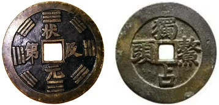

# TP00001

::: tip 基本信息

科目 : 历史

测试范围 : 中外历史纲要 (上)

测试主题/单元：第二单元/第七课 **隋唐制度的变化与创新**

要求 : 80%^

试题：T0000001-T0000013

:::

[T0000001] 史料可作为研究历史的证据。据《后汉书·章帝纪》，章帝曾在诏书中说：“前世举人贡士，或起甽亩，不系阀阅。”李贤的注称：“言前代举人，务取贤才，不拘门地。”由此可以判定当时（　　）

A．科举制度已初具雏形        B．阀阅之家享有一定选举特权

C．政治环境较为黑暗         D．世家大族垄断官员的任命

据下表1可知，3世纪上半期（　　）

[T0000002] 表1汉魏统治阶层社会成分的统计表（摘编自毛汉光《中国中古社会史论》）

|                   | 大族   |      | 小姓   |      | 平民   |      | 合计 |
| ----------------- | ------ | ---- | ------ | ---- | ------ | ---- | ---- |
| 数量              | 百分比 | 数量 | 百分比 | 数量 | 百分比 | 数量 |      |
| 汉（196—219年）   | 38     | 20   | 19     | 5    | 74     | 55   | 131  |
| 曹魏（220—239年） | 60     | 37   | 38     | 5    | 57     | 38   | 155  |
| 曹魏（240—264年） | 74     | 41   | 59     | 36   | 24     | 3    | 157  |

A．门阀士族势力受到抑制       B．汉代选官制制度得以延续

C．豪强地主垄断人才选拔       D．社会阶层的流动性减弱

[T0000003] 民俗钱币是古钱币的一种，大多由民间私制而成，是民俗文化的载体。寓意（　　）

> 清代民俗钱币图案 ^ 
>
> 右图（左一图文：状元及第；右一图文：独占鳌头。）

A．学以致用的价值取向     B．仁者爱人的思想主张

C．心外无理的哲学思想     D．克己复礼的行为规范

[T0000004] 据统计，晚唐科举人士中世族家庭出身者占74%，中等家庭和寒族出身者占6%。而到了北宋初期，世族家庭出身者仅占8%，中等家庭和寒族出身者却占82%。明清两代进士大约有4．9%出生于从未有过功名的家庭。这反映出科举制（　　）

A．使社会阶层流动加强        B．导致选官标准发生质变

C．促进了重教风尚形成        D．推动了贵族政治的瓦解

[T0000005] “（曹）魏以中书、尚书为主，两晋中书地位更加重要，门下逐渐崛起、与中书分权。南北朝时期，逐渐形成中书、门下、尚书三省，把皇帝下面的最高政务核心（以丞相为首的三公）分割成为决策、审议和执行三个职能比较明确的系统。”据此可知，三省制的形成（　　）

A．分割了帝王权力          B．提高了行政效率

C．加强了中央集权          D．强化了君主专制

[T0000006] 有学者认为，三省六部制就是决策、审议和行政权各自独立，政令与施政相分离，在决策层面不是由哪一个部门单独负责，而是由三个省共同进行，三省长官共同组成朝廷决策班子。这说明三省六部制（　　）

A．加强了皇帝权威          B．巩固了中央集权

C．实现了民主决策          D．有利于科学决策

[T0000007] 唐代安史之乱前，君主或宰相直接任命许多临时派遣官执行各种使命，如节度使、盐铁使等。安史之乱以后，这种使职差遣迅速发展，而原来的主管官员和机构的职权反而被逐渐剥夺。这一做法（　　）

A．破坏了中央集权的原则       B．标志着官僚制度的成熟

C．降低了地方的行政效率       D．调整了中枢的运行机制

[T0000008] 唐代经济学家陆贽认为“财之所生，必因人力”。他主张：“建官立国，所以养人也；赋人取财，所以资国也，故立国而不先养人，国固不立矣。”下列史实能体现上述观点的是（　　）

A．秦汉推行“重农抑商”       B．北魏至唐推行均田制

C．明代出现“计日受值”       D．明清实行“田赋征银”

[T0000009] 有学者指出：“实施《地令》或《田令》时，北魏、北齐采用双轨制：对待北鲜卑拓跋族聚居区来说确实是普遍授田制。对汉族为主聚居区，则只是限田制，同时也是一种户籍登记制度。隋唐未见按《田令》规定给吏民实际授田与土地还受的实例；相反，可直接反映未曾实际授田与土地还受的实例却很多。”材料主要反映了（　　）

A．均田制缺乏实施的社会基础     B．土地所有权的变更趋于频繁

C．土地归属观念影响制度实践     D．农民人身依附关系有所松弛

[T0000010] 《旧唐书·食货志》记载：“凡丁，岁役二旬，若不役，则收其庸，每日三尺（绢布，二旬合计六丈）”，而唐代每户一年的户调为“绢二丈、绵三两或布二丈五尺、麻三斤”。这说明唐代（　　）

A．实行“有役无赋”的税制      B．通过免除赋役保障农时

C．百姓的赋税负担愈加沉重      D．税制中力役仍然较沉重

[T0000011] 唐朝史学家杜佑在《通典》中指出两税法“恒额既立，加益莫由，浮浪（不定居的人）悉收，规避无所”、“人知定制，贪冒之吏，莫得坐奸，狡猾之氓（百姓），皆没其籍（登记并没收家产）”。杜佑认为两税法的实施可以起到的主要作用是（　　）

A．稳定了社会秩序          B．杜绝了贪官污吏

C．增加了农民负担          D．保证了国家收入

[T0000012] 阅读材料，回答问题。（12分）

::: tip 材料

科举制是在以德取人、以能取人基础上突出以文取人的一种全新的选官制度，是一种公开考试、公平竞争、择优录取的人才选拔制度，由于采用分科取士的办法，所以叫做科举。从隋代开始实行，经历了1300多年之久。科举制度自隋唐以来，一直是作为历代政府最基本的选官制度，富有极顽强的生命力。不管怎样改朝换代，不管有多少人用多少理由去抨击它，反对它，它都在不断地逐步完善和日益强化。其根本原因，就是科举制度本身的公平取士原则一直在起着主导作用。

——摘编自《浅谈古代中国科举制度》

:::

根据材料及所学中国古代史的相关知识，围绕材料中的一条或几条信息，自拟论题并进行阐释。（12分）（要求：论题明确，阐述时要有史实依据）

[T0000013] 阅读材料，完成下列要求。

材料反应了对古代中国选官制度发展演变历程的认识，对此认识提出你的修改建议，并说明理由。（要求：观点明确，持论有据，表述清晰。）

## 附录

[文件出处](https://www.zxxk.com/soft/39845055.html)
