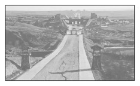

# TP00003

::: tip 基本信息

科目 : 历史

测试范围 : 中外历史纲要 (上)

测试主题/单元：**秦统一多民族封建国家的建立**

要求 : 80%^

试题：T0000036-T0000049

:::

[T0000036] 秦国李斯在《谏逐客书》中描述：“夫物不产于秦，可宝者多；士不产于秦，而愿忠者众。今逐客以资敌国，损民以益仇，内自虚而外树怨于诸侯，求国无危，不可得也。”秦王嬴政接受李斯建议，采取的措施是(　　)

A．任用商鞅变法  B．采取远交近攻

C．网罗天下英才  D．连接各国长城

[T0000037] 下图为秦直道鄂尔多斯东胜段遗址，长约20公里，号称中国首条“高速公路”。公元前212年，秦始皇命蒙恬修筑了从咸阳直通北边九原的直道，“长千八百里”。这项措施(　　)

A．促进了北疆与内地的交往

B．加速了国家完成统一进程

C．确立了君主专制中央集权

D．使匈奴这一民族得以消亡

[T0000038] 钱穆在《中国历史研究法》中说：自秦汉以来的郡县政治，到民国时代还存在，中国之永为一统一国，此项政治制度实贡献过其甚大之绩效。“甚大之绩效”指郡县制(　　)

A．导致官僚政治取代了贵族政治

B．形成中央垂直管理地方的体系

C．促进统一多民族国家的巩固和发展

D．标志着中央集权制度最终形成

[T0000039] 我国幅员辽阔，民族众多。各民族虽然都有自己的方言，但两千多年来各民族之间的文化交流从未间断过。这得益于(　　)

A．秦朝疆域辽阔  

B．秦朝统一货币

C．秦朝统一文字  

D．秦朝统一度量衡

[T0000040] 秦朝沿袭商鞅时代的法律，奖励军功：杀敌一人者赐爵一级，愿意做官的可以任五十石之官；杀敌二人者赐爵二级，愿意做官的可以任百石之官。由此出现大批军吏担任地方官员的现象。这一现象(　　)

A．加强了秦朝政治管理军事化

B．推动了秦代官僚政治的形成

C．加速了秦对东方六国的兼并

D．提高了秦朝的基层治理能力

[T0000041] 湖北云梦出土的秦简中的《工律》规定，制作同一种器物，其大小、长短和宽度必须相同；县和工室由有关机构校正其衡器权、斗桶和升，至少每年应校正一次，本身有校正工匠的，则不必代为校正。这说明秦朝(　　)

A．手工业产品的质量较高

B．鼓励民间手工业的发展

C．手工业均由官府所垄断

D．重视手工业标准化生产

[T0000042] 秦统一六国后，“(六国)王子皇孙，辞楼下殿，辇来于秦”；此外，六国富豪被迁至京城咸阳，一部分被迁到巴蜀、南阳、三川和赵地。秦始皇采取这些措施的主要目的是(　　)

A．巩固分封制   B．增强地方权力

C．加强中央集权  D．打破世袭特权

[T0000043] 为了钳制思想，秦始皇接受李斯的建议，下令天下将非秦国历史的史书，非博士所掌管的《诗》《书》等诸子百家语，在30天内全部交给官府焚毁。只有医药、卜筮、“种树之书”不在其列。秦始皇以“或为妖言以乱黔首”的罪名，将460余名儒生方士坑杀。这就是著名的“焚书坑儒”。由此可知“焚书坑儒”(　　)

A．巩固了秦朝的统治

B．钳制了思想，摧残了文化

C．推翻了儒学的正统地位

D．是秦始皇反对迷信的体现

[T0000044] 秦灭六国后废止六国旧钱，通行圆形方孔的秦半两钱。从社会发展角度看，该措施有利于(　　)

A．秦国最终完成统一  

B．彻底消灭六国

C．加强经济交流联系  

D．抵御匈奴的进攻

[T0000045]《史记》记载：“秦王发图，图穷匕首见……(荆轲)乃引其匕首以掷秦王，不中，中铜柱。”山东嘉祥武氏祠的汉代画像石《荆轲刺秦王》(下图)再现了这一场景。《史记》记载和这块画像石在(　　)

A．描绘上是一致的  B．形式上是一致的

C．风格上是一致的  D．主题上是一致的

[T0000046] 统一后的秦始皇穷奢极欲，大兴土木，建造宫殿、陵墓，征发繁重。秦二世继位后密织刑网，加重人民负担，阶级矛盾和统治阶层内部矛盾的尖锐化都达到极点，人民再也无法忍受下去，一场大规模的农民起义终于爆发。由此可知(　　)

A．秦朝暴政是秦朝灭亡的主要原因

B．秦朝建立了完备的法律制度

C．农民起义推翻了秦始皇的统治

D．刘邦发动了大泽乡农民起义

[T0000047] “秦的统治虽然如此短命，却给中国留下了深刻且持久的印记。”材料中“深刻且持久的印记”主要指(　　)

A．完成了国家统一

B．建立了专制主义中央集权制度

C．修筑了万里长城

D．暴政而亡为后世留下惨痛教训

[T0000048] 阅读材料，完成下列要求。(12分)

材料　秦始皇历来是一位充满争议的帝王。①汉代贾谊评价：“秦王……废王道，立私权，禁文书而酷刑法，先诈力而后仁义，以暴虐为天下始。”②李贽评价：“始皇帝，自是千古一帝也……李斯相之，天崩地坼，掀翻一个世界。”③唐太宗则说：“近代平一天下，拓定边方者，唯秦皇、汉武。始皇暴虐，至子而亡。”

根据材料中的三种观点并结合所学知识，对秦始皇作出合理评价。

 

 

 

 

 

 

 

[T0000049] 阅读文本是历史学习的基本要求。阅读材料，回答问题。(12分)

材料　古先民平(公平)其政者，莫遂(达到)于秦。秦皇负扆(扆，屏风。负扆，指皇帝临朝听政)以断天下，而子弟为庶人。所任将相，李斯、蒙恬皆功臣良吏也……末俗以秦皇方(比)汉孝武(汉武帝)……自法家论之，秦皇为有守。非独刑罚依科也，用人亦然……夫有功者必赏，则爵禄厚而愈劝……孝武一怒，则大臣莫保其性……世以秦皇为严，而不妄诛一吏也。由是言之，秦皇之与孝武，则犹高山之与大湫也……秦制本商鞅，其君亦世守法……非草茅、搢(缙)绅所能拟已。——章太炎《秦政记》

仔细阅读材料，并结合所学知识，指出材料中“秦制”建设的特点，并用一句话概括作者的主要观点。

 

 

 

 

 

 

