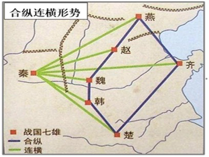
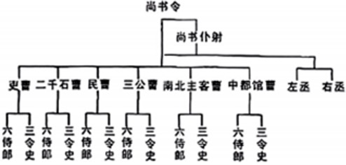

# TP00006

::: tip 基本信息

科目 : 历史

测试范围 : 中外历史纲要 (上)

测试主题/单元：**从中华文明起源到秦汉统一多民族封建国家的建立与巩固**

要求 : 80%^

试题：T0000084-T0000132

::: 

[T0000084] 考古发现，江浙良渚文化、广东石峡文化、山西陶寺文化在挖掘出大量极具地方特色文物的同时，均有作为祭祀礼器的玉琮出土。这可用于说明中华文明的特点是（  ）

A. 兼容并蓄           B. 多元一体        C. 和谐共存        D. 天人合一

[T0000085] 相当于五帝后期的龙山文化时代，中国大地上邦国林立，史称万邦时代。《史记•五帝本纪》曾记载：帝尧“能明驯德，以亲九族。九族既睦，便章百姓。百姓昭明，合和万国。”其中“九族”是与邦国君主家族血缘关系最近的宗族集团，即所谓“帝之九族”。据此可知，万邦时代（　　）

A. 奠定了多元一体文明的基础      B. 具备了国家的基本形态
 C. 已呈现血缘宗法的家国特征      D. 体现出聚族而居的特点

[T0000086] “王和帝代表着两个不同的历史时期。黄帝的帝和帝尧、帝舜的帝一样，实际上是中国原始社会部落联盟时期军事首长的称谓；而夏、商、周的王则是奴隶社会的专制君主”。导致这一变化的制度因素主要是（　　）

A. 都城建设制度凸显阶级色彩      B. 夏朝中央开始分类设置职官
 C. “私天下”取代“公天下”        D. 地方管理制度呈现松散特征

[T0000087] 根据甲骨文、金文等资料，商王朝的官职可分为最高政务、一般政务、宗教文化、军事等，地方则有侯、甸、男、卫等行政长官和基层行政官吏“族尹”。这说明商朝（　　）

A. 国家管理体制已初具规模       B. 摆脱了神权对王权的制约
 C. 王权具有浓厚的宗教色彩       D. 官职分工已十分细致明确

[T0000088] 商朝实行父子相继、兄终弟及的王位世袭制，西周确立了嫡长子继承制，春秋时期，嫡长子继承制遭到到破坏，常常出现立年长有德之人为国君的现象。这反映了嫡长子继承制（　　）

A. 成功避免了争夺王位继承权的斗争   B. 力图运用兄弟亲情维系政权稳定
 C. 直接促成了周天子天下共主的地位   D. 无法应对社会变革带来的新挑战

[T0000089] 2019年7月6日，中国良渚遗址被列入世界遗产名录。良渚聚落群中既有普通村落，也有大型宫殿建筑区；既有埋葬一般人和中小贵族的墓地，也有最高贵族的专用墓地。这表明良渚文化（　　）

A. 仍处于旧石器时代                    B. 处于母系氏族社会
 C. 是中华文明的起源地                  D. 已存在阶级分化

[T0000090] 考古学界在考察姜寨遗址墓地时，发现其早期的墓地多为单人葬，男女有别，长幼有序，只有成年男女才能葬在氏族墓地。后期的墓地积累成上下两层，下层仍保持单人葬传统，但已不如早期整齐，上层则为男女老幼合葬。据此推断，姜寨后期（　　）

A. 社会结构逐渐发生动摇       B. 母系氏族规则根深蒂固
 C. 私有制度取代公社公有       D. 贫富分化带来墓葬差异

[T0000091] 甲骨文是镌刻或写在龟甲和兽骨上的文字。殷墟出土的甲骨文，其内容绝大多数是王室向上天祈祷或者祭祀的卜辞。这表明，商朝时期（　　）

A. 文字尚未成熟           B. 层层分封等级森严
 C. 带有神权色彩           D. 天子权力高度集中

[T0000092] “殷革夏命”后，商族成为“天下共主”。商王朝一方面极力推行神权政治，神化商王的“天下共主”地位；另一方面实行外服和内服制度，细化中央王朝与方国之间的关系。商朝卜辞中留下了大量王室征讨方国的记录。上述材料说明商代（　　）

A. 王室与地方矛盾不断激化      B. 中央集权体制遭遇挑战
 C. 王权与神权开始有机结合      D. 地方管理方面有所改变

[T0000093] 《礼记•礼运》称禹以前为“大同”之世，禹以后为“小康”之世。前者的特点是“天下为公，选贤与能，讲信修睦，故人不独亲其亲，不独子其子”；后者的特点是“天下为私，各亲其亲，各子其子”。体现这一转变的是（　　）

A. 郡县制替代分封制         B. 世袭制替代禅让制
 C. 封建制替代奴隶制         D. 官僚制替代宗法制

[T0000094] 王国维先生在《殷周制度论》中指出：“自殷以前，天子、诸侯、君、臣之分未定也。逮克殷后新建之国，皆其功臣、昆弟、甥舅、本周之臣子，由是天子之尊，非复诸侯之长而为诸侯之君。”这反映了（　　）

A. 西周分封加强了对地方的控制    B. 商朝未能实现对地方有效管辖
 C. 血缘分封制成为中央集权的基础   D. 商周君臣关系是宗法制主要区别

[T0000095] 据《史记•五帝本经》记载，五帝之一的舜在位时，设置“八元”管土地，“八恺”管教化，契管人民，伯益管山林。同时，舜还镇压了所谓的“四凶族”等反对势力。这说明当时（　　）

A. 专制王权正式形成          B. 国家初始形态具备
 C. 王位世袭取代禅让          D. 原始民主制度完善

[T0000095] 晋国在献公以前，贵族主要依靠分封获取土地，分封的标准不是看功劳大小、能力高低，而是看血缘关系的亲疏远近。但到了晋文公时分封的原则变成了“尚贤使能”“论功行赏”。据此可知，晋文公时期（  ）

A. 尚贤标准得到普遍认可       B. 宗法分封制逐渐瓦解 
 C. 官僚政治得以正式确立       D. 诸侯权力被大臣架空 

 

[T0000096] 周平王死后，桓王即位，与郑国矛盾激化，刀兵相见，结果王室军队败北，桓王肩头还中了一箭，狼狈撤走。这反映出（　　）

A. 兼并战争影响政治稳定       B. 原有政治秩序遭到破坏
 C. 争霸战争郑国获得胜利       D. 分封制度开始走向崩溃

[T0000097] 春秋中期，楚庄王洛邑“问鼎”时，周天子以“天命”作为利器迫使楚国最终退兵。这件事可以反映出春秋时期（　　）

A. 传统宗法分封秩序得到恢复     B. 周天子“天下共主”的权威尚存
 C. 传统礼制备受各诸侯国尊崇     D. “尊王壤夷”的观念正逐渐形成

[T0000098] 春秋战国时，秦国地处西陲，长期与西戎为伍，但最终却取得了灭六国，一统天下的成就。下列各项能够构成秦国开创历史新局面的原因是其在战国七雄中（　　）

A. 地理位置比六国优越                  B. 长期与周边民族交流
 C. 置身于诸侯纷争之外                  D. 制度的变革卓有成效

[T0000099] 据如图可知，战国时期（　　）

A. 礼崩乐坏，百家争鸣                  B. 华夏认同，民族交融
C. 诸侯纷争，社会动荡                  D. 君主集权，变法图强

[T0000100] 东汉中期始，皇帝借宦官以抗外戚，其权势日益增强，桓、灵帝时，宦官“手握王爵，口含天宪”，党羽布列朝廷州郡。这主要反映了（　　）

A. 察举制失去了功效          B. 专制制度滋生宦官专权
 C. 外戚干政皇权旁落          D. 内朝权力扩张削弱相权

[T0000101] 考古工作者在战国七雄的疆域内普遍地挖掘到战国中、晚期的铁农具，河北石家庄一处遗址出土的铁农具即占同一地点出土的全部农具的65%，河南辉县固围村的五座魏国墓葬中就掘出了58件铁农具，河北兴隆及磁县都发现有用来制造锄、镰、镢等各种农具的铁制型范。这些发现表明，战国时期（　　）

A. 农业生产进步推动社会分工       B. 牛耕技术得到推广
 C. 铁农具在中原各国普遍使用       D. 手工业分工更加细密

[T0000102] 西周时期，“忠”是依附于“孝”的，臣对君可称“孝”，君对臣也可称“慈”，到了战国时期，“忠”与“孝”逐渐分离，“忠”的观念得到了强化。这种变化反映当时（　　）

A. 亲情伦理逐渐淡化                    B. 道德水平急速下降
 C. 宗法制度逐渐崩溃                    D. 君主专制空前强化

[T0000103] 春秋之前，诸侯国之间的边界较为模糊，存在大量的荒地，作为各诸侯国的缓冲区；春秋战国时期，诸侯国之间的界限逐步清晰。这一变化的原因有(  )

A. 分封制度的强化                      B. 井田制度的推广 
 C. 生产技术的进步                      D. 土地兼并的加剧 

[T0000104] 战国时期兼并战争日益剧烈，为了富国强兵，各国纷纷开展社会制度改革，通过变法先后建立起了代表封建地主阶级利益的君主专制制度。这说明各国变法(  )

A. 推动了社会转型                      B. 消除了兼并战争 
 C. 确立了官僚政治                      D. 促进了华夏认同 

[T0000105] 许倬云先生认为，从三代经春秋战国，中华共同体的演变趋向“乃是从属人的族群转变为属地的共同体”，商鞅变法措施中能够直接体现这一趋向的是（　　）

A. 奖励军功                            B. 废井田开阡陌
 C. 推行县制                            D. 什伍连坐制

[T0000106] 春秋战国时期出现了诸如儒家的“民贵君轻”、墨家的“节用利民”、道家的“精神足民”论以及法家的“以政裕民”等思想。这些思想的共同点是(  )

A. 重农抑商           B. 以农为本        C. 工商皆本        D. 以民为本

[T0000107] 战国时期某思想家的学说，告诉君主们如何使用法术和权术来统治其国家和人民。他总是站在君主的一边，即使有时顾及人民，也是为君主打算。据此判断，该思想家最有可能是（　　）

A. 荀子               B. 孟子            C. 墨子            D. 韩非子

[T0000108] 墨子认为君主的道德和功绩是承接天命的前提，获得君权以后，上天还会对君主的行为进行监督和赏罚。韩非子则继承了其老师荀子的观点“君者，舟也；庶人者，水也。水则载舟，水则覆舟”，认为君主的权势，民众可以夺取，也可以给予。墨子与韩非子探讨的共同话题是（　　）

A. 中央和地方的关系                    B. 社会秩序的维护手段
 C. 人性的善与恶问题                    D. 君主权力的来源问题

[T0000109] “臣闻地广者粟多，国大者人众，兵强则士勇。是以泰山不让土壤，故能成其大；河海不择细流，故能就其深；王者不却众庶，故能明其德……夫物不产于秦，可宝者多；士不产于秦，而愿忠者众。今逐客以资敌国，损民以益仇，内自虚而外树怨于诸侯，求国无危，不可得也。”据材料推知，秦走向统一的过程中（　　）

A. 重视实行广纳贤才的用人政策    B. 通过变革制度为崛起准备条件
 C. 对诸侯国实行远交近攻的战略    D. 政治优胜奠定军事胜利的基础

[T0000110] 唐朝柳宗元在《封建论》中提出：“今国家尽制郡邑，连置守宰，其不可变也固矣。”明末清初顾炎武《郡县论》中写到：“封建之废，非一日之故也，虽圣人起，亦将变而为郡县。”据材料，郡县制（　　）

A. 有利于权力分配与血缘关系相结合  B. 构建了中央与地方的官僚体系
 C. 适应了中央集权和国家治理的需要  D. 扩大诸侯权力并削弱中央集权

[T0000111] 李斯说：“周文、武所封子弟同姓甚众，然后属疏远，相攻击如仇雠（chóu），诸侯更相诛伐，周天子弗能禁止。今海内赖陛下神灵一统，皆为郡县，诸子功臣以公赋税重赏赐之，甚足易制。天下无异意，则安宁之术也。置诸侯不便。”据此可知，李斯主张（　　）

A. 推行郡县制以加强对地方的直接控制 B. 仿效西周分封诸侯以巩固天下
 C. 宣扬“君权神授”实现一统      D. 利用国家赋税增加官员的收入

[T0000112] 秦代设置三公九卿，九卿中奉常掌宗庙礼仪，位九卿之首；郎中令掌宫殿警卫，卫尉掌宫门警卫，太仆掌宫廷御马和国家马政，宗正掌皇族与宗室事务，少府掌专供皇室需用的山海池泽之税及官府手工业等。这体现了秦朝九卿官制（　　）

A. 各司其职，相互制衡        B. 为皇权服务，家国同构
 C. 职能分化行政效率提高       D. 官员由皇帝任免不再世袭

[T0000113] 秦以前，一般人均可自称“朕”。秦统一后，“朕”成为皇帝的专属自称，皇帝的命令专称为“诏”，其印章专称为“玺”，对皇帝的名字也要进行避讳。这些规定的主要意图是（　　）

A. 凸显皇帝独尊                        B. 保证皇帝独裁
 C. 重建礼乐文化                        D. 宣扬皇帝功业

[T0000114] 钱穆在《中国历代政治得失》一书中提到：严格说来，秦以前的中国，只可说是一种“封建的统一”，直到秦汉，中央方面才有一个更像样的统一政府。据此可知（　　）

A. 中国自古以来就是一个统一多民族国家
 B. 秦汉最高统治集团实现了权力的高度集中
 C. 先秦以前通过实行郡县制达到封建统一
 D. 秦汉时期中国古代中央行政体制已趋成熟

[T0000115] 一位西方学者这样评价秦始皇：“建立了绝对的专制制度，这一制度以个人亲信为基础，而不考虑世系和教育。”从人类政治文明发展的角度看，这一政治转向的积极意义主要在（　　）

A. 从血缘政治向官僚政治转变        B. 从军功政治向文治政治转变
 C. 从分权政治向专制政治转变        D. 从地方分权向中央集权转变

 

[T0000116] 秦末农民起义，陈胜建张楚政权，“张楚”意为“张大楚国”。它极具号召力，其后赵、齐、燕、魏等地纷纷打着恢复六国的旗号举兵响应。“当始皇之世，是统一之初，六国的遗民，本来不服，而此时也无治统一之世的经验，不知天下安定，在于多数人有以自乐其生，以为只要一味高压，就可以为所欲为了”。下列选项对秦亡原因的分析不合理的是（　　）

A. 地方行政制度激化阶级矛盾       B. 缺乏治理大一统国家的经验
 C. 受法家思想影响，施政暴虐       D. 原六国贵族与秦矛盾尖锐

[T0000117] 据《中国人口史》记载，西汉建立时人口约1650万，而到汉武帝元光六年时（前129年）人口达到3600万，仅黄河中下游这一全国人口最稠密的地区在六十年之中就增长了2.5倍，出现了多年未有的繁荣富庶的景象。这一现象产生的原因最可能是（　　）

A. 郡国并行导致势力膨胀        B. 休养生息促进民户繁息
 C. 铁犁牛耕的发明与推广        D. 打击豪强查明隐匿人口

[T0000118] 汉初统治集团吸取秦朝速亡的教训，采取与民休息的政策，减轻赋税、徭役和刑法，提倡节俭，减少财政支出，出现了文景之治的局面，与此相对应的治世思想是（　　）

A. 黄老学说           B. 法家思想        C. 儒家思想        D. 墨家思想

[T0000119] 汉武帝时，刺史巡察郡国以“六条问事”考查郡县长吏。第一条是诏问“强宗豪右，田宅逾制，以强凌弱，以众暴寡”，另外五条分别是打击地方豪强“侵渔百姓，聚敛为奸”、“怒则任刑，喜则淫赏”等行为。这一举措的主要目的在于（　　）

A. 加强中央集权，维护国家统一    B. 限制土地兼并，削弱豪强势力
 C. 阻止农民破产，增加政府收入    D. 防范官员腐败，稳定社会秩序

[T00001120] 西汉统治者总结秦朝历史，从“海内新定，同寡少，惩戒亡秦孤立之败”的认识出发，采取的措施是（　　）

A. 颁布“推恩令”                         B. 推行休养生息政策
 C. 实行编户制度                        D. 采取郡国并行制度

[T0000121] 如图为东汉时期中枢机构尚书台官制示意图。据此可知，尚书台的设置（　　）

A. 加强了中央集权                      B. 提高了国家治理效率
 C. 削弱了外朝权力                      D. 孕育了分权制衡理念

[T0000122] “西域自昔戎胡错居，道路时为闭塞。至汉征匈奴，武帝闻月氏族与匈奴有怨，欲诱之共击匈奴，乃遣张骞使月氏……后霍去病破匈奴右地，金城河西、盐泽之间，不复有匈奴，于是……设四郡，武帝发使抵安息、奄察、黎轩诸国，使者相望于道。”据材料可知西汉经营西域采取的措施包括（　　）
 ①联合西域共同打击匈奴 ②派张骞出使西域
 ③设置河西四郡管理西域 ④开通丝绸之路加强联系

A. ①③              B. ②④           C. ②③④         D. ①②③④

[T0000123] 汉武帝时期，曾经走马灯一样地换了13任丞相，其中除一人在汉武帝托孤时留任外，其他12位丞相被免职的有7人，有5人因犯罪自杀或被下狱治罪。被免职的7个人中也有2个人是非正常死亡。该历史现象说明（　　）

A. 汉代推崇法家思想                    B. 皇帝权威不断加强
 C. 中枢机构已经异变                    D. 西汉政治腐朽黑暗

[T0000124] 汉初，随着社会经济的复苏，各郡国和大商人开始把控盐铁生产。在汉武帝时期召开的盐铁会议上，桑弘羊对此提出：“民大富，则不可以禄使也；大强，则不可以罚威也。”会后，西汉政府推行盐铁官营。据此推断，汉武帝推行盐铁官营政策的初衷是（　　）

A. 严厉打击地方豪强势力的膨胀    B. 加强对商业活动的严格管理
 C. 加强国家对资源和市场的控制    D. 解决攻打匈奴所需经费问题

[T0000125] 公元前127年，汉武帝规定诸侯王除由嫡长子继承王位外，其他诸子都可在王国范围内分到封地，作为侯国。这一规定（　　）

A. 意在恢复西周的分封制      B. 使中央与地方矛盾激化
 C. 进一步加强了中央集权      D. 增强了地方封国的实力

[T0000126] 秦汉时期，社会普遍认为仿效“天”的构造、模拟“天”的运行、遵循“天”的规则，就可以获得思想与行为的合理性。董仲舒据此提出君主要“法天而治”，探知天意以便更好地践行天道。据此可知，董仲舒的主张（　　）

A. 顺应了社会文化心理发展     B. 背离了儒学民本思想传统
 C. 从根本上杜绝了君主专制     D. 被统治者确立为行政规范

[T0000127] 如图是东汉某一时期的社会现象图，这一现象出现的根源是（  ）

A. 皇帝权力的渐趋衰微                  B. 外戚宦官的交替专权 
 C. 宗族观念的根深蒂固                  D. 君主专制制度的弊端 

[T0000128] 两汉人民创造了灿烂的历史与文化，许多杰出人物给后世留下了宝贵的精神财富。霍去病“匈奴未灭，无以家为”的壮志，张骞“凿空”的勇气，苏武绝不“屈节辱命”的精神，马援“马革裹尸”的情怀，班超“投笔从戎”的追求。他们的事迹脍炙人口，广为流传的原因是都蕴含着（　　）

A. 耕读传家的理想                      B. 家国天下的情怀
 C. 格物致知的探究                      D. 无为而治的理念

[T0000129] 从理论上来说，举称“孝廉”时，地方官员应首先明察被举着者是不是具备了入仕的才干或者德行；但事实上，他们对仕人的判断往往以乡间评定为基础，而乡间评定是当地知名土人（名士）主持的，反映的是他们的观点。材料反映了（　　）

A. 地方官员行政效率低下       B. 察举制度存在明显缺陷
 C. 儒家思想成为选官依据       D. 豪强地主威胁中央集权

[T0000130] 汉武帝提出“罢黜百家，独尊儒术”，但根据《汉书》记载,张汤、桑弘羊等法家人物也受到重用。这体现了汉朝（  ）

A. 思想统一不足以巩固政权      B. 儒家思想在实践中名存实亡 
 C. 兼采百家之长的治国理念      D. 治国思想中儒法兼用的特征

[T0000131] 新疆地广物丰，风光秀美，民风奇特，文化灿烂。自古以来就是我国领土不可分割的一部分。早在二千多年前的西汉时期，中央政府就在此设置了（　　）

A. 北庭都护府                          B. 安西都护府
 C. 西域都护府                          D. 宣政院

[T0000132] 东汉和帝时规定，“郡国口二十万以上，岁察一人，四十万以上二人，六十万以上三人。不满二十万，二岁一人，不满十万，三岁一人”，至于边远州郡，则略有优待。这表明察举制的意义在于（　　）

A. 增强统一国家的凝聚力       B. 为封建政权选拔大批人才
 C. 缓和中央与地方的矛盾D. 削弱地方士族的政治势力

 

 

