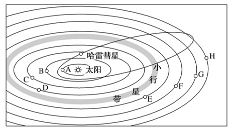

# TP00007

::: tip 基本信息

科目 : 地理

测试范围 : 

测试主题/单元：**地球的宇宙环境**

要求 : 80%^

试题：T0000133-T0000145

::: 

[T0000133] 下列属于天体的是(　　)

A．北极星 B．河外星系  C．天空中飘动的云 D．空中飞行的飞机

“太阳大，地球小，地球绕着太阳跑。地球大，月亮小，月亮绕着地球跑。”重温童谣，回答2～3题。

[T0000134] 童谣中出现的天体都属于(　　)

①太阳系　②地月系　③银河系　④河外星系　⑤总星系

A．①③⑤    B．①②③④⑤   C．①②④⑤    D．①③④⑤

[T0000135] 童谣中提及的天体系统共有(　　)

A．1级    B．2级     C．3级    D．4级

[T0000136] 太阳系八颗行星距太阳越远(　　)

A．质量越大    B．公转周期越短    C．公转周期越长    D．自转周期越短

读下表，完成5～6题。

|                 | 地球     | 火星     |
| --------------- | -------- | -------- |
| 质量(地球为1)   | 1.00     | 0.11     |
| 体积(地球为1)   | 1.000    | 0.150    |
| 平均密度(g/cm3) | 5.52     | 3.96     |
| 公转周期        | 1a       | 1.9a     |
| 自转周期        | 23时56分 | 24时37分 |

[T0000137] 人类首先在火星上探索地外文明的原因是地球与火星(　　)

A．质量相近   B．体积接近   C．公转周期最为接近   D．自转周期相近

6．液态水的存在是地球生命起源和发展的重要条件之一，下列叙述中与地球“液态水存在”无密切关系的是(　　)

A．地球的质量和体积适中

B．地球上昼夜更替的周期比较适中

C．地球大气层的存在

D．地球与太阳的距离比较适中

 “嫦娥五号”探测器由轨道器、返回器、着陆器、上升器四个部分组成。发射升空后，将自动完成月面样品采集，并从月球起飞，返回地球。据此完成7～8题。

[T0000138] “嫦娥五号”所绕转的天体属于(　　)

A．卫星    B．行星   C．恒星   D．星云

[T0000139] 进入月球轨道的“嫦娥五号”属于(　　)

①河外星系　②地月系　③银河系　④太阳系　⑤可观测宇宙

A．①②       B．①②③④       C．②③④⑤     D．①②③④⑤

[T0000140] 2017年8月21日，美国西海岸的俄勒冈州迎来日全食，美国华盛顿时间13时16分，太阳被月亮完全“吞没”。文字材料中包含的天体系统有(　　)

①河外星系　②总星系　③太阳系　④地月系

A．①②       B．②④     C．①③       D．③④

[T0000141] 下列各图中的大、中、小圆分别表示河外星系、太阳系、地月系，其中能正确表示它们三者之间关系的是(　　)

美国航天局2017年2月22日宣布，一个国际天文学家小组发现，在距地球仅40光年外发现围绕单一恒星运行的7颗系外行星。中心天体Trappist－1的质量和亮度分别只有太阳的1/10和1/200，温度只有太阳的1/2。天文学家认为，这一酷似太阳系的星系，堪称迄今寻找外星生命的最佳地点。据此完成11～12题。

[T0000142] 推测该天体系统属于(　　)

A．地月系   B．银河系     C．太阳系   D．河外星系

[T0000143] 天文学家推测该星系的某颗行星上可能存在生命，需要从哪些方面寻找论据(　　)

①大小与地球相似　②存在液态水　③距离中心天体较近　④拥有与地球相近的温度

A．①②③   B．②③④   C．①②④   D．①③④

[T0000144] 读“地球在太阳系中的位置”示意图，回答下列问题。

(1)八大行星中，离太阳最近的是________，太阳系中的小行星带位于________轨道和________轨道之间。(写行星名称)

(2)八大行星绕日公转有同向性，即都是自________向________。请在图中地球的公转轨道上用箭头表示出来。

(3)在哈雷彗星的轨道上任选三点画出彗尾。

(4)图中所示宇宙空间范围内共包括________级天体系统，其中最高一级天体系统是________，其中心天体是________。

(5)地球上存在生命物质与其所处的宇宙环境关系密切，此图所反映的有利的宇宙环境是什么？

(6)地球上存在生命物质的几个自身条件中，此图反映出来的是____________________________________。

[T0000145] (真实情境—学术情境)2018年7月，意大利科学家在火星南极冰盖下发现一个宽约20千米的液态水湖泊。这是一项“重大科学发现”。阅读地球和火星的有关资料 (如下表)，完成下列各题。

|      | 与太阳的  平均距离  (108 km) | 赤道半  径(km) | 公转  周期 | 自转  周期    | 质量(地  球为1) | 体积(地  球为1) | 赤道面与  公转轨道  面的夹角 |
| ---- | ---------------------------- | -------------- | ---------- | ------------- | --------------- | --------------- | ---------------------------- |
| 地球 | 1.496                        | 6 378          | 1年        | 23时56  分4秒 | 1               | 1               | 23°26′                       |
| 火星 | 2.279                        | 3 395          | 1.9年      | 24时  37分    | 0.11            | 0.15            | 23°59′                       |

(1)按由近及远的顺序，火星在太阳系八大行星中，是位于第________轨道上的行星。

(2)在表格中火星与地球的数据比较接近的是______________________、__________________；火星表面的温度比地球的____________________(填“高”或“低”)。 

(3)火星上发现液态水湖泊为什么被称为“重大科学发现”（4分）？

 

 

 

 

(4)你认为火星上会有高级智慧生命“火星人”吗？根据上表数据分析说明（6分）。

 

出处：21.docx
