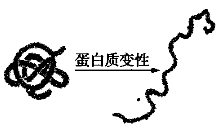
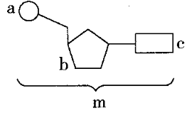
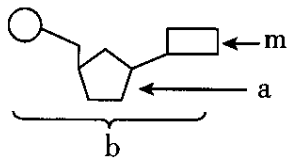
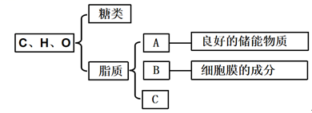
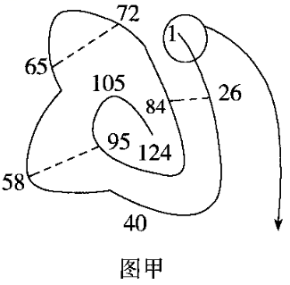
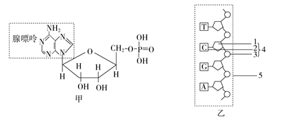

# TP00008

::: tip 基本信息

科目 : 地理

测试范围 : 

测试主题/单元：第二章章末检测试题

要求 : 80%^

试题：T0000146-T0000177

::: 

[T0000146] 在细胞的组成元素中，最基本、含量最多、占细胞干重（去除水）最多的元素分别是(  )

A.N、H、O	B.C、C、C	C.C、O、C	D.H、O、C

[T0000147] 关于生物组织中有机物的鉴定实验，下列叙述不正确的是(  )

A.还原糖的鉴定可用西瓜汁作实验材料

B.还原糖与斐林试剂发生反应生成砖红色沉淀

C.脂肪被苏丹Ⅲ染液染成橘黄色

D.蛋白质与双缩脲试剂出现紫色反应

[T0000148]  向甲、乙、丙三支试管中分别加入2mL葡萄糖标准液、2mL梨匀浆，2mL鸡蛋清稀释液，再各加入1mL斐林试剂，均置于60℃恒温水浴锅中加热2min，观察试管中的颜色变化。下列预期结果及相关分析有误的是(  )

A.甲试管中会发生从浅蓝色溶液到砖红色沉淀的颜色变化

B.水浴加热后，乙试管中出现砖红色沉淀

C.乙试管中的现象与甲的相同，说明梨匀浆中含有葡萄糖

D.丙试管中的溶液呈浅蓝色，说明鸡蛋清稀释液中不含还原糖

[T0000149] 下列有关水的叙述不正确的是(  )

A.水在低温下结冰，利于细胞处于休眠状态从而抵抗不利环境

B.水分子间形成的氢键决定水具有流动性，这是物质运输所必需的

C.水具有较高的比热容，为细胞创造舒适的液体环境

D.水是极性分子决定了其是细胞内良好的溶剂，为生物化学反应所必需

[T0000150] 下列有关生物体内水和无机盐的叙述，错误的是(  )

A.结合水不直接参与细胞代谢，但失去结合水会使细胞代谢降低

B.带有正电荷或负电荷的分子都容易与水结合，故水是良好的溶剂

C.北方冬小表在冬天来临之前，细胞中自由水/结合水的值逐渐降低

D.无机盐既能调节细胞的渗透压，也能为细胞生命活动提供能量

[T0000151] 晒干的小麦种子只有吸收足够的水分才能萌发。下列说法错误的是(  )

A.水是小麦鲜种子细胞中含量最多的化合物

B.种子细胞内的自由水和结合水均能参与物质运输和化学反应

C.晒干种子的目的是减少自由水的含量，降低代谢水平，便于储藏

D.种子萌发过程中，细胞中自由水与结合水比值会变大，利于萌发

[T0000152] 茶叶生产在中国已有几千年的历史，下列关于茶叶的说法，错误的是(  )

A.茶叶细胞中含有Ca、Mg、S、K、P等大量元素

B.采摘的新鲜茶叶细胞中含量最多的有机物是蛋白质

C.茶叶细胞和人体细胞所含元素种类大致相同但含量差异很大

D.地壳与新鲜茶叶细胞中含量最多的元素都是氧，说明生物界与无机自然界具有统一性

[T0000154] 下列关于斐林试剂与双缩脲试剂的叙述错误的是(  )

A.斐林试剂的实质是新配制的Cu（OH）2

B.双缩脲试剂检测蛋白质的实质是碱性环境中的Cu2+与蛋白质中的肽键发生反应

C.往梨汁样液中加入斐林试剂，会立即出现砖红色沉淀

D.往豆浆中加入双缩脲试剂，可出现紫色反应

[T0000155] 下列有关细胞中的水和无机盐的叙述,正确的是(  )

A.水分子以自由水和结合水两种形式存在

B.结合水是多种离子良好的溶剂

C.大多数无机盐以化合物的形式存在

[T0000156] 一些无机盐参与生物体内重要化合物的形成，下列相关叙述错误的是(  )

A.细胞内的无机盐主要以离子的形式存在

B.腺苷三磷酸、磷脂的合成都需要消耗

C.人成熟的红细胞合成血红蛋白时需要消耗Fe2+

D.T2噬菌体不能用培养基培养

[T0000157] 糖类是动植物细胞中重要的组成成分,下列关于糖类的说法不正确的是(  )

A.糖类都是由C、H、O三种元素组成的	B.糖类是生物体的主要能源物质

C.糖原、淀粉都是动物细胞内的多糖	D.纤维素是构成植物细胞壁的主要成分

[T0000158] 下列关于细胞中糖类的种类及其分布的叙述，错误的是(  )

A.麦芽糖属于二糖，在发芽的小麦等谷粒中含量丰富

B.纤维素属于多糖，存在于小麦、水稻等植物细胞中

C.脱氧核糖属于单糖，广泛存在于动物和植物细胞中

D.几丁质属于多糖，广泛存在于各种动物的骨骼中

[T0000159]  不同的糖类在细胞中的作用不同，下列关于糖类作用的叙述，不正确的是(  )

A.葡萄糖是细胞内主要的能源物质

B.纤维素是植物细胞壁的主要成分

C.所有糖类都能提供能量

D.糖原主要分布在人和动物的肝脏和肌肉中，是人和动物细胞的储能物质

[T0000160] 下列有关脂质的叙述，错误的是(  )

A.常见的脂质主要由动物脂肪和植物脂肪组成

B.人体内脂肪过多将增加心脏负担，脂肪的摄入应适度

C.维生素D能有效地促进人体肠道对钙和磷的吸收

D.人体内胆固醇可构成细胞膜的成分，还可参与血液中脂质的运输

[T0000161] 下列关于脂质的叙述，其中正确的是(  )

A.磷脂由C、H、O三种元素组成，是构成细胞膜的主要成分

B.性激素能促进人和动物生殖器官的发育和生殖细胞的形成，在核糖体中合成

C.检测花生子叶中的脂肪实验时，可用稀盐酸洗去浮色

D.胆固醇含量高，容易在血管壁沉积，因此摄取高胆固醇的食物应适量

[T0000162] 下列关于糖类和脂质的叙述，错误的是(  )

A.质量相同的糖类和脂肪被彻底氧化分解，糖类耗氧少

B.并非所有的糖都是能源物质，如脱氧核糖是DNA的成分

C.脂质具有储存能量、构成细胞结构以及调节等功能

D.糖类是细胞中主要的能源物质，主要原因是糖类在活细胞中的含量比脂质高

[T0000163] 下列叙述不属于蛋白质功能的是(  )

A.红细胞中的血红蛋白具有运输氧气的功能

B.有的蛋白质是细胞内携带遗传信息的物质

C.许多蛋白质是构成细胞和生物体结构的重要物质

D.细胞中的化学反应离不开酶的催化，酶的化学本质有蛋白质

[T0000164] 蛋白质是生命活动的主要承担者。下列有关蛋白质的说法正确的是(  )

A.不同蛋白质的结构、功能不同，但一般都是由氨基酸脱水缩合形成肽链，由肽链盘曲、折叠形成的

B.蛋白质变性后，肽键断裂，不能利用双缩脲试剂进行检测

C.蛋白质具有催化、免疫、运输、调节、携带遗传信息等功能

D.蛋白质含有C、H、O、N等元素，其中N元素只能连在肽键的一侧

[T0000165] 如图为某多肽的结构简式，据图分析下列说法正确的是(  )

A.该多肽中含1个游离的氨基、2个游离的羧基

B.该多肽由4种氨基酸脱水缩合而成，含有4个肽键

C.形成该多肽时，脱去的水中的氧来自羧基，氢来自氨基

D.高温、X射线、强酸、食盐等均会破坏蛋白质的空间结构，使其变性

[T0000166] 下列有关蛋白质结构的叙述中，正确的是(  )

A.蛋白质加热后会变性，就不能与双缩脲试剂发生颜色反应

B.一条多肽链分解成*n*条短肽链时，增加的羧基数为*n*-1

C.肽键的连接方式不同是影响蛋白质结构多样性的原因

D.雄激素是蛋白质类激素，其功能体现了蛋白质具有信息传递作用

[T0000167] 蛋白质受到物理或化学因素的影响后会出现结构改变而导致生物活性的丧失。下列关于蛋白质的叙述不合理的是(  )

A.蛋白质变性后仍能与双缩脲试剂产生紫色反应

B.蛋白质变性后容易被蛋白酶分解成小分子，因此熟食更易被消化

C.病毒、细菌经高温或化学物质的处理后其蛋白质失活，失去侵染能力

D.蛋白质变性过程中结构的改变与肽键以及氢键数目的变化有关

[T0000167] 下列关于蛋白质和肽链的叙述，错误的是(  )

A.进行蛋白质鉴定实验时，可以选择大豆种子或鸡蛋清作为实验材料

B.氨基酸脱水缩合成肽链时，形成的肽键中的H来自氨基酸的氨基

C.真核细胞中形成的分泌蛋白需要借助囊泡的运输才能分泌到细胞外

D.在高温条件下，蛋白酶催化蛋白质分子水解的过程更容易进行

[T0000168] 下列关于生物体内组成蛋白质的氨基酸的叙述，正确的是(  )

  A.组成人体的氨基酸都能在人体细胞内合成

 B.每种氨基酸都只有1个羧基和1个氨基

  C.丙氨酸的R基团为—CH3，所以丙氨酸的分子式是C3H7O2N

  D.氨基酸与双缩脲试剂发生作用，产生紫色反应

[T0000169] 下列关于核酸的说法错误的是(  )

A.DNA病毒中脱氧核糖的组成元素是C、H、O、N、P

B.由A、G、T、U四种碱基参与合成的核苷酸有6种

C.真核细胞和原核细胞的遗传物质都是DNA

D.核酸的多样性取决于核苷酸的种类、数目及排列顺序

[T0000170] 核苷酸是核酸的基本组成单位，下列关于核苷酸的叙述，正确的是(  )

A.核苷酸的组成元素是C、H、O、N B.核苷酸种类不同取决于碱基的不同

C.组成DNA的五碳糖是核糖	D.HIV含4种核苷酸

26、图示m为核酸的基本单位，下列有关叙述不正确的是(  )

A.m的元素组成为C、H、O、N、P

B.a是磷酸基团，c是含氮碱基

C.大肠杆菌细胞内的m有4种

D.b为脱氧核糖时，m为DNA的基本组成单位

[T0000171] 下图为某同学在学习DNA的结构后画的含有两个碱基对的DNA片段（“○”代表磷酸基团），下列为几位同学对此图的评价，其中正确的是(  )

A.甲说：“物质组成和结构上没有错误”

B.乙说：“只有一处错误，就是U应改为T”

C.丙说：“有三处错误，其中核糖应改为脱氧核糖”

D.丁说：“若他画的是RNA双链，则该图应是正确的”

[T0000172] 如图所示，b是由1分子磷酸、1分子碱基和1分子a构成的化合物，下列叙述正确的是(  )

A.若m为腺嘌呤，则b肯定为腺嘌呤脱氧核苷酸

B.在禽流感的病原体、幽门螺杆菌体内b均为4种

C.ATP脱去两个磷酸基团可形成b，a为脱氧核糖

D.若a为脱氧核糖，则由b构成的核酸完全水解，得到的化合物最多有6种

[T0000173] 核酸是遗传信息的携带者。下列有关核酸的组成和分布的表述错误的是(  )

A.DNA和RNA都能携带遗传信息

B.核酸是生物的遗传物质，仅存在于细胞核中

C.刑侦人员可通过DNA指纹获取嫌疑人信息的根本原因是人的遗传信息储存在DNA分子中

D.人体细胞内含有2种五碳糖、5种碱基、8种核苷酸

[T0000174] 下列关于DNA和RNA的叙述，不正确的是(  )

  A.DNA和RNA中只有五碳糖不同	B.原核细胞中既有DNA又有RNA

 C.叶绿体、线粒体中含有DNA	D.DNA和RNA都能携带遗传信息

[T0000175] 现有无标签的稀蛋清、葡萄糖、淀粉和淀粉酶溶液各一瓶,可用双缩脲试剂、斐林试剂和淀粉溶液将它们鉴别出来(注:淀粉酶是蛋白质,可催化淀粉水解成麦芽糖)。

(1)用一种试剂可将上述四种溶液区分为2组,这种试剂是___________________,其中发生颜色反应的一组是____________________溶液,不发生颜色反应的是____________________溶液。

(2)用____________________试剂区分不发生颜色反应的一组溶液。

(3)区分发生颜色反应的一组溶液的方法及鉴定结果是:发生颜色反应组的两种溶液各取少许,置于不同的试管中,分别滴加5滴____________________溶液,充分振荡,静置半小时。向静置后的反应液中加入斐林试剂,水浴加热后,出现砖红色沉淀的为_______________________________溶液。

(4)在检测生物组织中的可溶性还原糖､脂肪､蛋白质实验中，唯一需要显微镜的是__________的检测，用苏丹Ⅲ染液对脂肪组织进行染色时，颜色反应是_______________________色，可用来冲洗浮色的药品是________________________（带体积分数）｡

[T0000176] 冬小麦一般在9月中下旬至10月上旬播种，翌年5月底至6月中下旬成熟。在冬季来临过程中，随着气温的逐渐降低，冬小麦体内会发生一系列适应低温的生理变化，抗寒能力逐渐增强。翌年，农民在储存小麦种子前，需将刚收获的小麦种子晒干后，才收进粮仓存放。请回答下列有关问题：

（1）活细胞中含量最多的化合物是____________ 。

（2）冬小麦在冬天来临前，____________的比例会逐渐降低，而____________的比例会逐渐上升，原因是________________________________________________________________________。

（3）农民晒种时小麦种子失去的主要是以____________的形式存在于细胞中的水，当把种子晒干后放在试管中点燃，直至燃成灰烬，此过程中失去的水分主要是__________________，灰烬是__________________________________。

（4）储存小麦种子前，如果暴晒的时间不够长，在粮仓中储存时小麦会产热导致霉烂。通过上述事实可以看出，细胞的代谢强弱与细胞的__________________有密切联系。

[T0000176] 下图为生物组织中糖类和脂质的功能及分布的概念图,请据图回答下列问题:

(1)在糖类中,一般能被细胞直接吸收的是_________________。常见的二糖有蔗糖、麦芽糖和乳糖,我们吃的红糖、白糖、冰糖的主要成分是_________________。分布在人和动物的肝脏和肌肉中的多糖是_________________。

(2)组成脂质的化学元素主要是C、H、O,而B中还含有_________元素。与糖类分子相比,脂质分子中氢的含量_____________。

(3)在C类物质中, _____________可参与血液中脂质的运输。

[T0000177] 如图甲表示某蛋白质的肽链结构示意图，其中数字表示氨基酸序号，虚线表示脱去2个H形成的二硫键，如图乙表示该肽链的部分放大图，请据图回答下列问题：

（1）该蛋白质的肽链是由____________个氨基酸脱去____________个水分子而成的，这种反应叫________________。

（2）蛋白质结构的多样性与____________有关。

（3）图乙所示结构中含有的R基是____________(填数字)。

（4）从图乙可推知该蛋白质至少含有________个游离的羧基、________个游离的氨基。

（5）该蛋白质的相对分子质量比组成它的氨基酸的相对分子质量之和少____________。

[T0000178] 下图中图甲所示的分子结构式为某种核苷酸，图乙是某核苷酸链示意图，据图回答问题：

(1)图甲中核苷酸的名称是____________________，是构成________________的原料，该核酸主要分布在______________中。

(2)通常由____________条图乙所示的核苷酸链构成一个_____________分子，该核酸的中文名称是_______________，分布在真核细胞的_________________。

