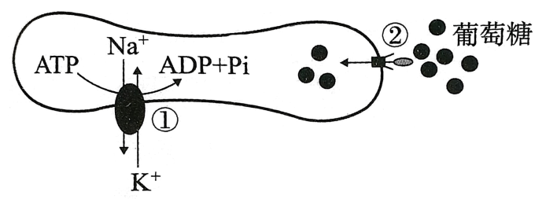
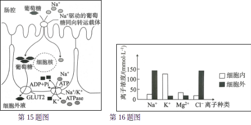
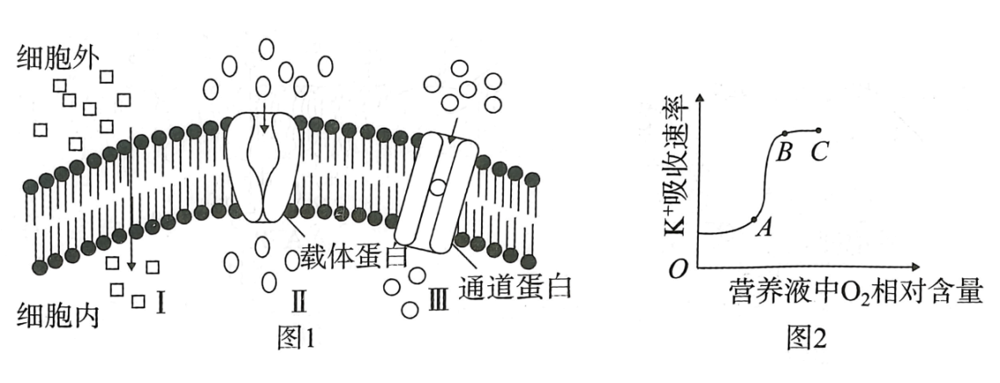

# TP00018

::: tip 基本信息

科目 : 生物

测试范围 : 高一上册

测试主题/单元：主动运输与胞吞胞吐

要求 : 80%^

试题：T0000354-T0000367

::: 

[T0000354] Na⁺、K⁺和葡萄糖等物质出入人体成熟红细胞的方式如图所示，①②表示相关过程。其中过程①和②的方式分别为 (      )

A. 协助扩散、自由扩散		B. 自由扩散、协助扩散

C. 协助扩散、主动运输		D. 主动运输、协助扩散

	第1题图                                  第2题图

[T0000355] ABC转运蛋白是一类跨膜转运蛋白，参与细胞吸收多种营养物质，每一种ABC转运蛋白对物质运输都具有特异性。ABC转运蛋白的结构及转运过程如图所示。下列有关叙述正确的是 (      )

A. 细胞中ATP供应越多，ABC转运蛋白转运物质的速率就越快

B. ABC转运蛋白主要协助氨基酸顺浓度梯度跨膜运输

C. ABC转运蛋白在转运离子的过程中发生空间构象的改变

D. ABC转运蛋白可提高红细胞对O₂的跨膜运输速率

$

[T0000356] 如图表示小肠绒毛上皮细胞的细胞膜对不同物质的转运情况(箭头表示方向，黑点数量表示物质的浓度)。

下列叙述正确的是 (      )

A. a物质可能是氧气，b物质可能是K⁺

B. a物质可能是水，b物质可能是甘油

C. a物质可能是乙醇，b物质可能是氧气	

D. a物质可能是葡萄糖，b物质可能是氨基酸

[T0000357] 阿米巴痢疾是一种消化道传染病，病因是感染了在人体肠道内寄生的痢疾内变形虫。该虫能分泌蛋白分解酶，溶解人的肠壁组织，再通过胞吞作用“吃掉”肠壁组织细胞，引发阿米巴痢疾。下列分析错误的是 (      )

A. 饭前便后洗手是预防阿米巴痢疾的有效措施之一

B. 该虫分泌蛋白分解酶的过程促进了其生物膜成分的更新

C. 该虫分泌蛋白分解酶是通过胞吐作用，不需要细胞提供能量

D. 痢疾内变形虫“吃掉”肠壁组织细胞的过程需要消耗能量

[T0000358] 已知动物细胞胞外 Na⁺ 浓度比胞内高，而K⁺ 浓度比胞内低。 Na⁺−K⁺ 泵是一种分布在细胞膜上的酶，可以水解ATP，同时依赖自身构象改变逆浓度梯度泵出3个Na⁺、 泵入2个K⁺。 以维持细胞内高K⁺ 低Na⁺ 的离子环境。下列相关叙述正确的是 (      )

A. Na⁺ 通过动物细胞细胞膜的跨膜运输方式为主动运输

B. 动物细胞内的K⁺顺浓度梯度运输到细胞外需消耗ATP

C. Na⁺−K⁺ 泵将Na⁺ 泵出细胞、K⁺泵入细胞的方式均为主动运输

D. Na⁺−K⁺ 泵能同时泵出3个Na⁺、 泵入2个K⁺，说明其不具有特异性

[T0000359] 图a、图b 表示物质进出细胞的两种运输方式。下列叙述错误的是 (      )

 A. 物质以图a中的方式进入细胞需要消耗能量

B. 白细胞可通过图a中的方式吞噬外来的病菌

C. 胰岛素通过图a中的方式进入细胞发挥作用

D. 图a，b中的两种运输方式可能需要细胞膜上蛋白质的参与

[T0000360] 下列甲、乙、丙三个示意图所示的物质运输方式依次为(      )

A. 自由扩散、主动运输、胞吞		B. 协助扩散、自由扩散、胞吐

C. 协助扩散、主动运输、胞吐		D. 自由扩散、协助扩散、胞吐

题型4影响物质跨膜运输的因素

[T0000361] 如图是几种物质进出细胞方式中，运输速率与影响因素间的关系曲线图。下列与图相关的叙述，正确的是 (      )

A. 与甘油进出细胞相符的图有①③⑤	B. 与葡萄糖进入红细胞相符的图有②④⑥

C. 与K⁺进入丽藻细胞相符的图有②④⑤		D. 与蛋白质进出细胞相符的图有②③⑥

[T0000362] 图一表示某生物体内甲、乙、丙、丁四种物质通过细胞膜的过程，图中①②③为细胞膜相关组成成分，图二表示O₂含量变化对小肠上皮细胞吸收K⁺ 速率的影响。下列有关叙述正确的是 (      )

A. 图一中细胞膜的上侧是细胞膜的外侧，①和③构成细胞膜的基本支架

B. 图二说明吸收K⁺ 的方式是主动运输，这种方式对应于图一中的甲通过细胞膜的方式

C. 若图一中丁表示葡萄糖，则该细胞不可能是哺乳动物红细胞

D. 图二中K⁺ 吸收速率不再增加时，限制因素是载体蛋白数量和O₂含量

[T0000363] 小肠上皮细胞的载体蛋白SGLT1和GLUT2都能运输肠腔内的葡萄糖，SGLT1可以逆浓度梯度吸收葡萄糖，GLUT2只在肠腔内葡萄糖浓度高于小肠细胞时才会发挥作用。下图为小肠上皮细胞葡萄糖运输速率与细胞外葡萄糖浓度的关系曲线，下列分析正确的是 ( )

A. 载体蛋白SGLT1运输葡萄糖是协助扩散

B. 两种运输葡萄糖的方式依赖的动力不同

C. SGLT1和GLUT2的空间结构相同	

D. 两种对葡萄糖的吸收方式不能同时进行

[T0000364] 研究者将大蒜的根分别浸入不同浓度的磷酸盐溶液中，4h后测定得到如图所示的PO43− 吸收速率曲线。对本实验现象作出的下列分析，合理的是 (      )

A. PO43− 通过自由扩散进入大蒜根尖细胞

B. PO43− 吸收速率受到膜上载体数量制约

C. PO43− 通过主动运输进入大蒜根尖细胞

D. PO43− 通过协助扩散进入大蒜根尖细胞

[T0000365] 大分子进出细胞靠胞吞和胞吐来完成，下列说法错误的是 (      )

A. 胞吞和胞吐的实现依赖于膜的流动性

B. 胞吞和胞吐也是具有选择性的

C. 血红蛋白的分泌过程为胞吐

D. 婴儿从母乳中吸收抗体以提高自身的免疫力，推测该过程应为胞吞

[T0000366] 如图为物质跨膜运输示意图(甲、乙、丙代表物质，a、b、c、d、e代表运输方式)，下列叙述中错误的是 (      )

A. 动物细胞间的信息交流离不开丙

B. 制备细胞膜可选用鸡血作实验材料

C. 在a~e的五种方式中，代表被动运输的是b、c、d

D. 图中b可表示氧气进入细胞的过程

[T0000367] 为探究细胞吸收葡萄糖的条件，将兔的红细胞和肌肉细胞分别置于含有质量分数为5.0%的葡萄糖培养液中进行实验，一段时间后测定培养液中葡萄糖的含量，结果如表。

| 组别 | 培养条件             | 肌肉细胞 | 红细胞 |
| ---- | -------------------- | -------- | ------ |
| 甲   | 加入葡萄糖载体抑制剂 | 5.0%     | 5.0%   |
| 乙   | 加入呼吸抑制剂       | 4.7%     | 3.5%   |
| 丙   | 不做任何处理         | 2.5%     | 3.5%   |

下列分析正确的是 (      )

A. 该实验的对照组为甲组，因变量为培养液中葡萄糖的含量

B. 甲组与丙组比较，可知肌肉细胞和红细胞吸收葡萄糖均需要通道蛋白

C. 乙组与丙组比较，可知肌肉细胞和红细胞吸收葡萄糖均需要能量

D. 实验结果说明肌肉细胞吸收葡萄糖的方式既有主动运输，也有协助扩散

[T0000368] 如图为动物小肠上皮细胞对葡萄糖的运输过程，据图分析，下列说法正确的是 (  )

A. 小肠上皮细胞内的Na⁺ 浓度高于细胞外液

B. 当葡萄糖由上皮细胞进入细胞外液时，驱动该过程的动力来自ATP的分解

C. 葡萄糖由肠腔进入上皮细胞消耗的能量由Na⁺顺浓度进入细胞的势能提供

D. 葡萄糖进出上皮细胞需要的载体种类是相同的

1如图表示一个神经细胞内外不同离子的相对浓度，离子的浓度差能保持相对稳定。下列叙述正确的是 (      )

A. 维持细胞内外K⁺浓度差的过程中不需要消耗ATP

B. 维持细胞内外Na⁺浓度差的过程中相应载体蛋白不发生形状改变

C. Mg²⁺ 通过主动运输从细胞外进入细胞内，以维持浓度差

D. Cl⁻ 通过主动运输从细胞外进入细胞内，以维持浓度差

[T0000370] 图1是物质的几种跨膜运输方式示意图。图2是在完全营养液中培养的南瓜幼苗中氧气含量变化对K⁺吸收速率的影响曲线。回答下列问题：

(1)图1中的方式Ⅰ代表的跨膜运输方式是_____，方式Ⅲ代表的跨膜运输方式是_______。

(2)过去人们普遍认为，水分子都是通过图1的方式Ⅰ进出细胞的，但后来的研究表明，水分子更多的是借助细胞膜上的_________以图1的方式____(填图1中编号)进出细胞的。

(3)据图2判断，南瓜幼苗根系细胞吸收K⁺的方式____________(填“属于”或“不属于”)图1的Ⅰ、Ⅱ或Ⅲ，作出该判断的理由是___________________________________。

(4)图2中曲线AB段限制K⁺ 吸收速率的因素是_______，BC段影响K⁺ 吸收速率的内部因素是______________。

出处：30.docx