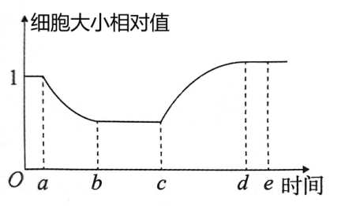
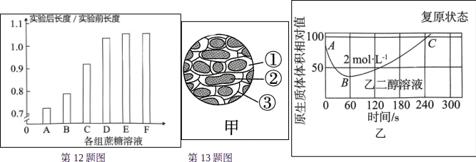

# TP00019

::: tip 基本信息

科目 : 生物

测试范围 : 高一上册

测试主题/单元：被动运输

要求 : 80%^

试题：T0000371-T0000382

::: 

[T0000371] 下列现象属于渗透作用的是 (      )

①水分子通过植物细胞的细胞壁	②水分子或其他溶剂分子通过细胞膜

③蔗糖分子通过细胞壁	④水分子或其他溶剂分子通过液泡膜

⑤水分子或其他溶剂分子通过原生质层		⑥夏天新鲜蔬菜在空气中萎蔫

A. ①②③		B. ②④⑥		C. ②④⑤		D. ①③⑤

[T0000372] 如图表示某个渗透装置(开始时长颈漏斗与烧杯中的液面高度一致)，烧杯中盛有蒸馏水，猪膀胱膜仅允许单糖分子和水分子通过，倒置长颈漏斗内先装入蔗糖溶液，一定时间后再加入蔗糖酶。下列描述正确的是 (      )

A. 实验过程中，长颈漏斗和烧杯中的水分子是单向移动的

B. 长颈漏斗中液面先上升，加酶后先继续上升，然后下降

C. 加酶前，长颈漏斗内的液面上升的结果导致猪膀胱膜两侧的溶液浓度相等

D. 加酶后，可以在烧杯中检测出葡萄糖、果糖和蔗糖酶

[T0000373] 观察植物细胞质壁分离及复原过程，其操作流程如图。下列叙述错误的是 (      )

A. ①通常选用洋葱鳞片叶的外表皮		B. ②可观察到几乎整个细胞呈紫色

C. ⑥水分子进出细胞的方向是双向的	D. ④细胞液紫色加深，细胞吸水能力减弱

[T0000374] 当一个植物细胞发生渗透作用时，下列说法错误的是 (      )

A. 植物细胞的原生质层相当于一层半透膜

B. 一定条件下，活的、成熟的植物细胞能发生渗透失水或吸水

C. 当外界溶液的浓度 = 细胞液的浓度时，细胞处于动态平衡，水分子不能进出细胞

D. 当外界溶液的浓度>细胞液的浓度时，细胞发生渗透失水；当细胞液的浓度>外界溶液的浓度时，细胞发生渗透吸水

[T0000375] 某同学进行“观察洋葱鳞片叶表皮细胞的质壁分离及质壁分离复原”实验时，将观察到的某个原生质体大小变化情况绘制成了曲线(如图)。下列叙述正确的是 (      )

A. b~c段，由于失水，细胞液浓度逐渐减小

B. c-d段，水分子的运动方向只从细胞外进入细胞内

C. d时与c时相比，细胞吸水能力增强

D. e时液泡的颜色比a时浅

[T0000376] 乙两种物质分别依赖自由扩散和协助扩散进入细胞，如果以人工合成的磷脂双分子膜(不含蛋白质)代替细胞膜，并维持其他条件不变，则 (      )

A. 甲运输被促进		B. 乙运输被促进		C. 甲运输被抑制		D. 乙运输被抑制

[T0000377] 下列关于物质跨膜运输的说法，错误的是 (      )

A. 二氧化碳在大气中的浓度极低，为其从人体内自由扩散而出提供了便利条件

B. 一氧化碳对人体有害，但也能自由扩散进入人体，说明细胞膜对物质进出的控制是相对的

C. 转运蛋白只允许与自身结合部位相适应的分子或离子通过且每次转运时自身构象都会改变

D. 分子或离子通过通道蛋白时，不需要与通道蛋白结合

[T0000378] 1950年，科学家在用氢的同位素标记的水分子进行研究时，发现水分子在通过细胞膜时的速率高于通过人工膜(人工膜，仅由双层磷脂构成)时的速率。据此推测水分子跨膜运输方式有可能是 (      )

A. 自由扩散			B. 协助扩散		C. 自由扩散和协助扩散	D. 主动运输

[T0000379] 关于渗透作用原理在生活中的应用，下列叙述错误的是(      )

A. 果脯在腌制中慢慢变甜，是细胞渗透作用吸收糖分的结果

B. 为维持细胞正常形态，输液时常用生理盐水作溶剂输送药物

C. 利用高浓度盐水腌制的咸肉能存放较长时间

D. “烧苗”可能是由田间一次性施肥过多引起的

[T0000380] 五个大小相同的马铃薯幼根与物种A的幼根分别的入甲、乙、丙、丁、戊五种不同浓度的蔗糖溶液中，数小时后，取出称重，质量变化如图所示。下列关于该实验结果的说法正确的是(      )

A. 物种A比马铃薯更耐干旱

B. 在甲溶液中加入适量蔗糖酶，最初一段时间，其中的马铃薯幼根细胞液浓度将减小

C. 物种A在与马铃薯根细胞液等渗的完全培养液中不能正常生长

D. 甲、乙、丙、丁、戊五种不同浓度的蔗糖溶液中，丙浓度最高

[T0000381] 将哺乳动物成熟的红细胞置于三种浓度的葡萄糖溶液中，水分子进出细胞的情形如图所示，其中箭头及其粗细分别表示水分子出入的方向和多少。下列叙述正确的是 (      )

A. 水分子出入细胞的方式是自由扩散

B. 甲细胞和乙细胞正在发生渗透吸水

C. 丙细胞的细胞质浓度大于外界溶液浓度

D. 哺乳动物成熟的红细胞吸收葡萄糖需要消耗ATP

[T0000382] 某同学将紫色洋葱鳞片叶外表皮细胞置于A~F六组不同浓度的蔗糖溶液中一段时间后，测得实验后与实验前原生质体平均长度的比值数据如图所示。下列分析正确的是 (      )

A. 这六组蔗糖溶液中，F组蔗糖溶液的浓度最高

B. 实验后，C组细胞的吸水能力可能大于B 组细胞的

C. 实验后向细胞滴加清水，B组原生质体恢复初始长度的时间可能比A组细胞的短

D. 实验后，E、F组蔗糖溶液的浓度是相同的

[T0000383] 探究植物细胞在乙二醇溶液中的吸水和失水情况。现将紫色洋葱鳞片叶表皮浸润在物质的量浓度为 2mol·L⁻¹ 的乙二醇溶液中，观察表皮细胞质壁分离及复原现象(如图甲)，得到原生质体体积大小的变化曲线(如图乙)。下列叙述错误的是 (      )

A. 图甲中③是细胞壁，②是液泡，①中含有乙二醇溶液

B. 图乙中BC段说明乙二醇进入细胞内，引起细胞液浓度增大，细胞吸水

C. 图甲现象说明原生质层与细胞壁在伸缩性上存在显著差异

D. 图甲所示的现象发生在图乙AB段所示的过程中

[T0000384] 某同学进行“植物细胞质壁分离和复原”实验，所用材料为紫色洋葱鳞片叶及菠菜叶，试剂是蔗糖溶液和清水。

(1)在上述实验中，若质壁分离后不能复原，其原因可能有:①_______________， ②____________________。若改用相同质量浓度的葡萄糖溶液，则会使细胞开始发生质壁分离时所用时间更_______________(填“长”或“短”)。

(2)该同学撕取菠菜的叶表皮，剪成大小相等的小块，分别浸入不同浓度的NH₄NO₃溶液中，经过一段时间后，用显微镜观察到的实验结果如表。

| NH4NO3溶液浓度 			(mol·L-1 			) | A    | B    | C        | D        | E        | F        |
| ------------------------------------------------- | ---- | ---- | -------- | -------- | -------- | -------- |
| 0.11                                              | 0.12 | 0.13 | 0.14     | 0.15     | 0.50     |          |
| 质壁分离程度                                      | —    | —    | 初始分离 | 分离     | 显著分离 | 显著分离 |
| 质壁分离复原状态                                  | —    | —    | 自动复原 | 自动复原 | 诱发复原 | 不能复原 |

菠菜叶表皮细胞的细胞液浓度约为__________。细胞发生质壁分离的结构基础是_______________，外界条件是_______________。C组和D组均发生质壁分离后自动复原，你对这种现象作出的合理解释是____________________。

出处:29.docx

