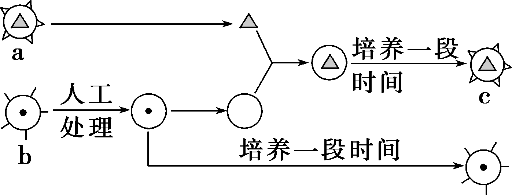
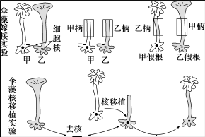
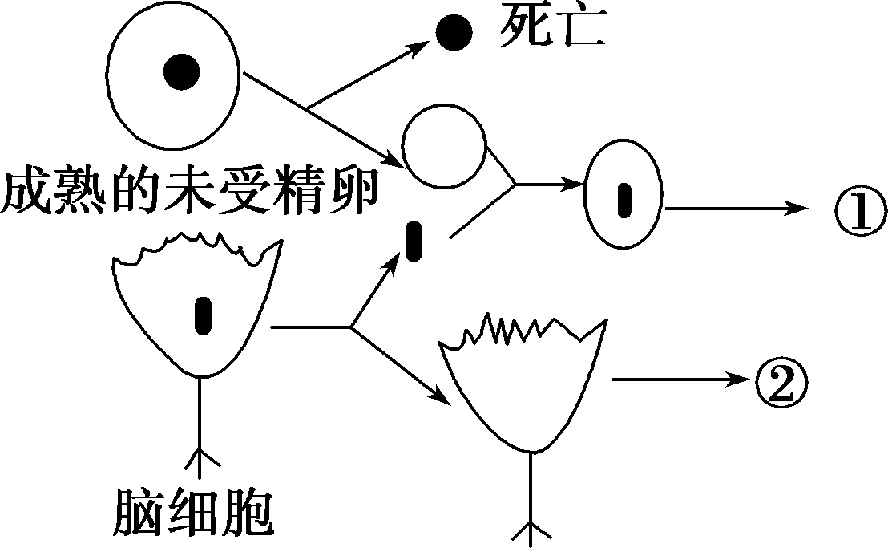

# TP00020

::: tip 基本信息

科目 : 生物

测试范围 : 高一上册

测试主题/单元：**细胞核的结构和功能**

要求 : 80%^

试题：T0000383-T0000396

::: 

[T0000383] 将一只黑色公绵羊的体细胞核移入白色绵羊的去核卵细胞中，并将此卵植入另一只黑色绵羊子宫内发育，生出的小绵羊即克隆羊。那么，此克隆绵羊为(　　)

A．黑色公绵羊　　　　　　	B．黑色母绵羊

C．白色母绵羊 	D．白色公绵羊

[T0000384] 用真核细胞a、b做下图实验，最能说明(　　)

A．细胞c的性状由细胞核控制

B．细胞c的性状由细胞质控制

C．细胞核控制生物的一切性状

D．细胞c的性状由细胞核和细胞质共同决定的

[T0000385] 下列为黑白美西螈核移植实验流程示意图，据图分析不正确的是(　　)

A．该实验的目的是证明黑色美西螈的肤色由细胞核控制

B．该实验说明细胞核是遗传的控制中心

C．可将白色美西螈胚胎细胞核移植到黑色美西螈去核卵细胞中形成重组细胞进行培养，作为对照

D．美西螈细胞核的核膜主要由磷脂和糖类组成

[T0000386] 细胞核是由核膜、染色质、核仁、核孔组成的，下列相关叙述不正确的是(　　)

A．核膜是双层膜，把核内物质与细胞质分开

B．染色质主要由DNA和蛋白质组成

C．核仁与某种RNA的合成以及核糖体的形成有关

D．核孔实现了细胞间的信息交流

5下列结构中均能让某些大分子物质直接通过的是(　　)

A．线粒体和叶绿体 	B．细胞壁和核孔

C．高尔基体和核糖体 	D．内质网和液泡

[T0000388] 大量事实表明，在蛋白质合成旺盛的细胞中，常有较大和较多的核仁，根据这一事实可以推测(　　)

A．细胞中的蛋白质主要由核仁合成

B．核仁可能与组成核糖体的必需物质的合成有关

C．无核仁的细胞往往不能合成蛋白质

D．核仁中有DNA，能控制蛋白质的合成

[T0000389] 下列关于细胞核的叙述，正确的是(　　)

A．真核细胞的核膜上有核孔，脱氧核糖核酸等大分子物质可以通过核孔进入细胞质

B．在光学显微镜下观察真核细胞，可以看到细胞核的主要结构有核膜、核仁和核孔

C．真核细胞的核膜上有大量的多种酶，有利于多种化学反应的顺利进行

D．原核细胞的拟核除没有核膜外，其他方面与真核细胞的细胞核没有差别

[T0000390] 模型是人们为了某种特定目的而对认识对象所作的一种简化的概括性的描述，下列关于生物模型的说法，正确的是(　　)

A．利用废旧物品制作的真核细胞结构模型属于概念模型

B．电镜下拍到的线粒体结构属于物理模型

C．分泌蛋白的合成和分泌过程示意图属于概念模型

D．模型只能对生物问题进行定性描述，而不能进行定量描述

[T0000391] 图甲为细胞中某一结构的模式图，图乙表示图甲中3的成分及其各级结构。据图回答下列问题：

(1)图甲所示结构为________________结构。

(2)图甲中2所示结构是________。单位面积的该结构数目与细胞类型和代谢水平有关，人的胰岛B细胞比口腔上皮细胞中该结构的数目________(填“多”“少”或“相同”)。

(3)图乙中①控制②的合成，①是________分子，鉴定②的试剂为________________。

(4)图乙中①在动物细胞中除了在③和④上，还分布在________中。

[T0000392] 下图为伞藻嫁接实验与伞藻核移植实验示意图，该实验结果说明(　　)

A．生物体形态结构的建成主要与细胞质有关

B．细胞的分裂和分化是由细胞核控制的

C．细胞核是细胞代谢的中心

D．细胞核是细胞遗传的控制中心

[T0000393] 核小体是染色质的结构单位，是由近乎球状的组蛋白形成的八聚体和在其外围绕两圈长度为180～200 bp(碱基对)的DNA所构成。下列有关核小体的叙述，不正确的是(　　)

A．染色质主要由DNA、组蛋白构成

B．酵母菌中存在核小体

C．普通光镜下可观察到核小体

D．核小体中含有C、H、O、N、P

[T0000394] 核孔是一组蛋白质以特定的方式排布形成的结构，被称为核孔复合物，它是细胞质与细胞核内物质输送活动的看护者。如下图所示，该复合物由一个核心脚手架组成，其具有选择性的输送机制由大量贴在该脚手架内面的蛋白质决定，这些蛋白质称为中央运输蛋白。据此分析，下列叙述错误的是(　　)

A．核膜由4层磷脂分子组成，核孔复合物与核膜内外的信息交流有关

B．核孔复合体是一类具有选择性的核质之间物质进出的通道，如特定的蛋白质、RNA和DNA可以通过

C．一般来说，代谢活跃的细胞，其核孔复合物数量较多

D．核孔并不是一个简单的孔洞，而是一个相对独立的复杂结构

[T0000395] 下图为细胞核结构模式图，下列有关叙述不正确的是(　　)

A．①主要由DNA和蛋白质组成，在细胞分裂不同时期呈现不同状态

B．②与某种RNA的合成以及核糖体的形成有关

C．③的主要成分是磷脂和蛋白质，具有流动性

D．蛋白质、DNA及RNA等大分子物质可以随意通过核孔进出细胞核

[T0000396] 蛙成熟的未受精卵处于活跃的DNA合成状态(为分裂作准备)，而脑组织细胞则不能分裂。科学家进行了核移植实验，回答下列问题：

(1)请预测结果：①____________________，②________________。

(2)细胞核对细胞质的代谢有__________作用，细胞质为细胞核代谢提供____________________。

(3)蛙的未受精卵中DNA合成所需的酶是在细胞质基质中的__________上合成的，并通过__________进入细胞核中。

(4)实验表明单独的细胞核和去核的细胞质都不能存活，说明________________。

出处：27

