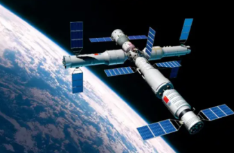
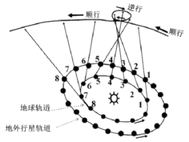
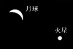
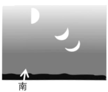
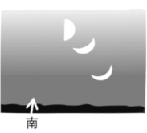
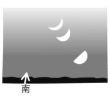
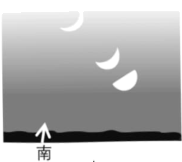
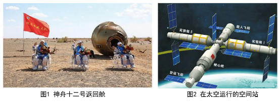
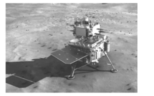
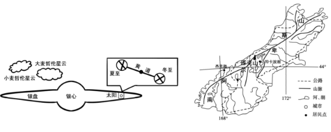

# TP00038

::: tip 基本信息

科目 : 地理

测试范围 : 高一上册

测试主题/单元：第一章 宇宙中的地球  第1节  地球的宇宙环境

要求 : 80%^

试题：T0000753-T0000769

::: 

(2023广东高三模拟)中国空间站(“天宫”)建设和研发面临很多技术上的挑战。为保障航天员的生活、工作顺利进行以及空间站的长期运营，“天宫”实验舱布置了大型柔性太阳翼(太阳能电池板)，太阳翼的角度可调节(下图)。据此完成下面小题。

 

[T0000753] “天宫”实验舱布置了柔性太阳翼，主要是为了(   )

A.避免陨石撞击   B.躲避太阳风暴   C.接受更多光照   D.减弱风力影响

[T0000754] 推测空间站长期运营需克服的困难有(   )

①地球引力较大    ②太空垃圾威胁

③太阳风暴强烈    ④物资循环利用

A.①②	B.②③	C.②④	D.③④

(2023湖南邵阳高三模拟)2023年3月24日的傍晚，天空上演“月掩金星”天象，这次月掩金星在非洲南部、印度洋、亚洲南部可以看到。“月掩金星”是指月球运行至地球与金星之间，三者排成一条直线，月球在金星前面“路过”。由于月球的视直径远大于金星的视直径，因此在“路过”的时候会把金星完全挡住，金星会在很短的时间内完全“消失”一阵子再出现。据此完成下面小题。

[T0000755] 上述材料中涉及的天体类型组合正确的是(   )

A.恒星、行星	B.行星、卫星	C.卫星、彗星	D.恒星、彗星

[T0000756] 与火星相比，地球上有生命存在的基本条件之一是(   )

A.体积和质量较大	B.太阳光照稳定

C.强烈的火山活动	D.充足的液态水

(2023江苏徐州高三模拟)北斗七星由七颗星组成，找到“天璇”和“天枢”后，用假想的线连接起来，将线段向“天枢”方向延长五倍，便可找到北极星。下图为“3月中旬某研学小组某日北京时间18时拍摄并标注的星空图”。据此完成下面小题。

 

[T0000757] 绘制时该同学面朝(   )

A.东北	B.西北	C.东南	D.西南

[T0000758] 拍摄地可能位于(   )

A.昆仑山脉   B.云贵高原   C.台湾山脉   D.辽东丘陵

(2023河北秦皇岛高三二模)中秋赏月在我国有着悠久的传统，“日落而东升”、“明月皎皎挂南天”的美景曾倾倒了无数国人。2022年中秋节当天，国内的一些航空公司推出了“赏月航班”，届时飞机上的乘客可以透过舷窗欣赏到美丽的满月。下表是当天的部分航班资料。据此完成下面小题。

| 航班序号 | 出发地 | 起飞时间 | 目的地 | 终到时间 |
| -------- | ------ | -------- | ------ | -------- |
| ①        | 南昌   | 18:55    | 沈阳   | 22:20    |
| ②        | 长春   | 13:35    | 宁波   | 16:30    |
| ③        | 重庆   | 19:45    | 上海   | 23:50    |
| ④        | 杭州   | 20:05    | 兰州   | 23:20    |

[T0000759] 要想拥有更好的赏月体验，航班及座位应选择(   )

A.①航班，右侧靠窗   B.②航班，左侧靠窗

C.③航班，右侧靠窗   D.④航班，左侧靠窗

[T0000760] 与地面相比，飞行中赏月(   )

①视野更加开阔    ②月亮更加清澈    ③天气干扰更频繁    ④“月随人行”更显著

A.①③    B.①④    C.②③    D.②④

(2023浙江杭州高三二模)火星合月是从地球上观察，火星与月球比较接近的现象。行星逆行是指以恒星为参照物，地球上观察到的一种行星的逆向运动，图为某地外行星的逆行示意图。完成下面小题。

 

[T0000761] 2022年11月11日(农历十八)21点46分出现火星合月现象，下图为某中学生所绘制当时的火星合月示意图，正确的是(   )

A. 	    B. 

C.          D. 

[T0000762] 关于行星逆行描述正确的是(   )

①行星体积质量的差异是行星逆行的主要原因

②行星公转速度的差异是行星逆行的主要原因

③地内行星不会发生行星逆行现象

④行星、恒星、地球接近于同一直线才会发生逆行现象

A.①②    B.③④    C.①③    D.②④

(2023浙江高三模拟)北京时间11月29日23时08分，搭载神舟十五号载人飞船的长征二号F遥十五运载火箭在酒泉(40°N，98°E)卫星发射中心点火发射。发射瞬间，出现了难得一见的箭月同框现象(见图)。完成下面小题。

 

[T0000763] 此时，与日地月三者的相对位置最为接近的运行轨道示意图是(   )

 

[T0000764] 某人在该地的一天前和两天后的同一方位同一时刻观看到月相及其空间位置正确的是(   )

A. 	B. 

C. 	D. 

(2023全国高三专题训练)2021年9月17日，神舟十二号返回舱安全降落在东风着陆场预定区域，媒体报道了相关事宜，有细心的网友发现，着陆的返回舱外表看起来“颜值”不是那么高。时隔一个月，10月16日神舟十三号载人飞船发射取得圆满成功，当日，多地网友在夜空中拍到我国空间站过境祖国上空，直呼美极了。读下面两幅图片，据此完成下面小题。

 

[T0000765] 图1中的神舟十二号返回舱表面有类似“烧焦”的痕迹，与其成因类似的是(   )

A.流星   B.极光   C.彗星   D.磁暴

[T0000766] 按照天体类型，在太空运行的空间站属于(   )

A.恒星   B.行星   C.流星   D.卫星

(2023湖南衡阳高三一模)2020年11月24日，我国成功发射嫦娥五号探测器，开启了中国首次地外天体采样返回之旅。嫦娥五号在月球表面采集约2千克月壤返回地球。下图为嫦娥五号在月球表面工作示意图。据此完成下面小题。

 

[T0000767] 有关材料中所呈现的天体及天体系统，说法正确的是(   )

A.月球是地球的唯一卫星               B.环月飞行的嫦娥五号属于地月系

C.由探测器带回地球的月壤样品是天体   D.图中涉及的天体系统中心天体是木星

[T0000768] 目前月球上未探测到生命迹象，主要是因为月球(   )

①距太阳更近    ②没有大气层   ③有安全的宇宙环境    ④昼夜温差过大

A.①②    B.②③    C.③④    D.②④

[T0000769] (2023全国高三专题练习)璀璨的星空能够震撼人们的心灵。而一张好的星空照片则包含星辰的数量、清晰度、罕见度和构图创意等。每年6、7月，众多来自北半球的星空摄影爱好者齐聚新西兰特卡波湖附近，尽情享受与星空邂逅的浪漫。在南半球的夜空中，大、小麦哲伦星云是璀璨群星中最壮观的景观之一。特卡波湖位于南岛的中部，南阿尔卑斯山脉以东，海拔710米，面积约96平方千米，是著名的“国际黑暗天空保护区”。特卡波镇为维护“暗夜天空”的声誉，一直对辖区内的关灯时间进行着管控。图为部分天体系统示意图及南岛简图。

 

(1)结合相关知识，解释每年6、7月份，北半球的星空摄影爱好者青睐南半球夜空环境的原因。

(2)说明与杰克逊贝和库克山相比，在特卡波湖附近进行星空摄影的主要优势。

(3)说出特卡波镇对辖区内的关灯时间进行管控的地理意义。

出处：47

